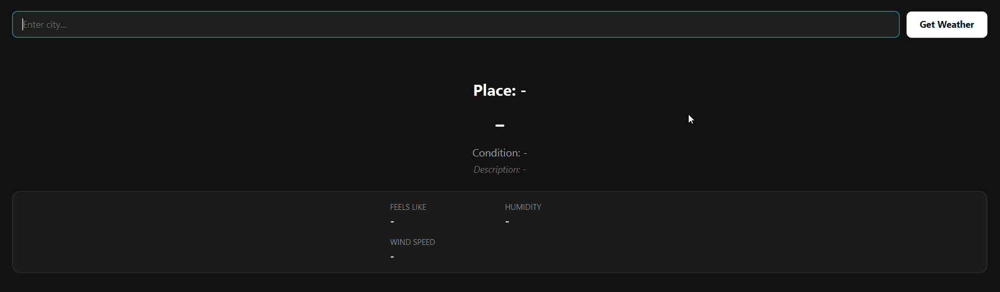

# JavaFX Weather App
A clean and modern desktop weather application built in Java using JavaFX and the OpenWeatherMap API. This project focuses on real-time API integration and building a modern GUI-based application with a sleek dark-mode dashboard that displays live weather information.

## Features
* Search weather by city name
* Real-time weather data using OpenWeatherMap API
* Displays key weather information
* Error handling for invalid input and failed API requests
* Clean minimalist dark-mode user interface designed entirely via a custom JavaFX CSS stylesheet

## Tech Stack
* **Language:** `Java`
* **GUI Framework:** `JavaFX` (FXML & CSS Styling)
* **Build Tool:** `Maven`
* **API:** `OpenWeatherMap API (REST)`
* **Data Format:** `JSON` Parsing

## Architecture
This project follows the Model-View-Controller (MVC) design pattern:
* **Model (`WeatherData`):** Data model that structures and stores the parsed weather information.
* **View (`weather-view.fxml` & `style.css`):** The visual layout and premium dark styling layer.
* **Controller (`WeatherController`):** Manages user interactions, event handling, and bridges the View and the Service.
* **Service (`WeatherService`):** Orchestrates the external REST API requests and handles JSON parsing.
